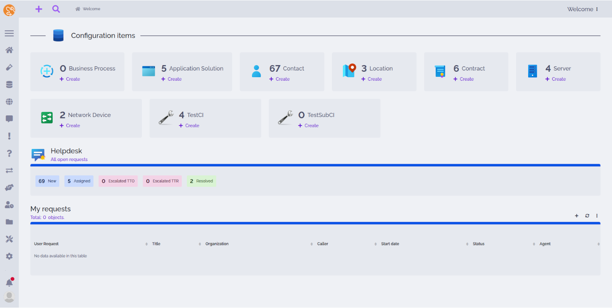
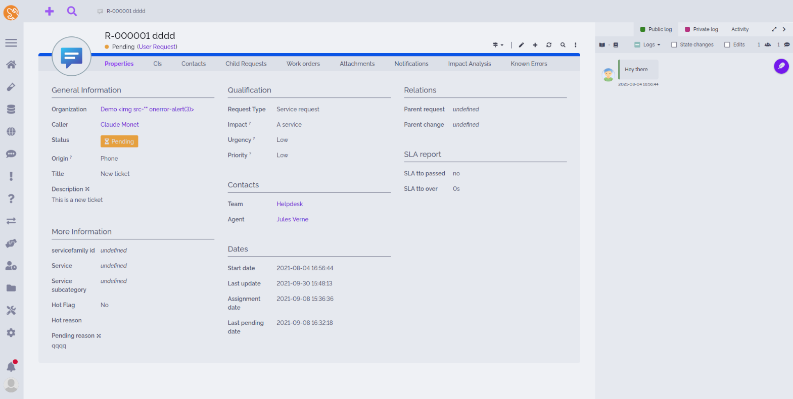

<h3 align="center">
	 
	
	Catppuccin latte theme for iTop
	
</h3>

	
	
	

## Previews

	

	

## Usage

1. If using releases, extract `dist/*` into your extension folder, otherwise extract `steffunky-backoffice-celestial-latter-theme` and <a href="https://github.com/steffunky/itop-backoffice-light-theme-base">itop-backoffice-light-theme-base</a>
2. Run a setup
3. Select `Celestial Latte` in your preferences

## Contributing

Modify any scss file using iTop variables, then run a setup or a toolkit